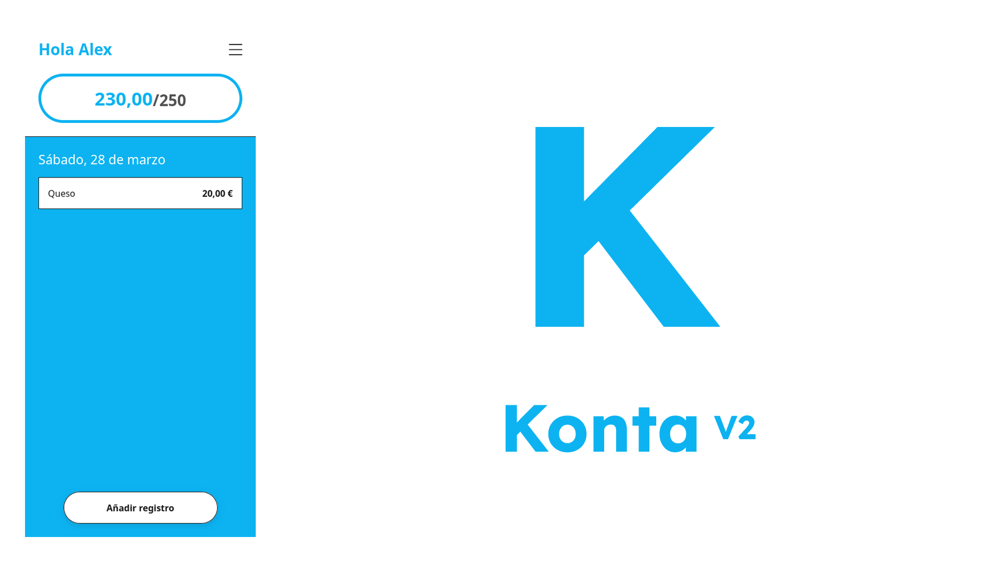

  <h1>Kroma Startpage</h1>
  

---

## Links

Figma: https://www.figma.com/design/whzvUpnmXPRucAcqazPn2m/Konta-V2?node-id=0-1&t=PSkuYnStfNZ6JBZq-1

Página: https://personal-kroma.pages.dev/

---

## Konta (resumen)
Konta es una app de gestión de gastos semanales simples (hecha principalmente para mi familia y yo) para apuntar apuntar gastos y llevar el control del presupuesto semanal. 

A nivel de diseño he usado un estilo Neo-Brutalista minimalista (nuevamente os podréis dar cuenta de cual es mi estilo favorito) con una UX a prueba de padres (literalmente, mis padres saben usar la app), pero no solo me he conformado con una buena UX, también he intentado hacer una DX (Developer experience) de libro.

A nivel de código volvemos al amor mi vida, JAMstack (Javascript, API, Marcado (html y css son lenguajes de marcado)) con JS (semi) Vanilla, usando solo 2 librerías para dar soporte completo a Apple (que a saber cuando empiezan a dar soporte a APIs nativas que cualquier navegador de android tiene), css puro, y mi querido cloudflare.

## Funciones
Vamoh a empezar (siempre hago una broma andaluza aquí, parezco gilipo...). Si bien es cierto que no estamos ante una app sumanente compleja (de hecho busco lo contrario, que sea simple), voy a omitir las funciones técnicas para centrarme en las funciones de la app, la que todos los usuarios van a usar (sin necesidad de tocar o configurar un solo worker).

### Login sin fricción y seguridad:
Esto no es una función que vais a ver, pero si de la que váis a disfrutar. La arquitectura base es frágil a nivel de seguridad, quiero decir, cualquier persona con la url podría acceder a vuestros gastos, por eso añadí ciertas cositas que complicarán la vida a niveles insospechados de aquellos con malas intenciones. 

Pero primero, vamos con el login. Para el usuario promedio, simplemente tendrá que introducir un usuario (que el creador le tiene que dar), y escanear un QR (que nuevamente el admin le tiene que dar). La idea del QR scan se basa en que escribir la url de un worker es un coñazo, con todo respeto, así que es mucho mejor escribirla una sola vez (al admin), y ya luego que el resto de usuarios puedan escanearla para evitar posibles errores o fricción.

Por otra parte, el meter una contraseña hubiera sido un punto de fricción para alguien que simplemente quiere apuntar lo que le cuesta al pan, así que se hizo una contraseña invisible. El móvil genera una clave (UUID v4) con la API nativa de criptografía del navegador (especificamente la crypto.subtle), y esa clave se manda a la base de datos (D1). 

El worker (lo que modifica la base de datos) pide el usuario y esa clave, que se guarda a nivel de localstorage, y si concuerda con la que hay en D1, aprueba la acción que el usuario intenta hacer. Si bien es cierto que este metodo es susceptible a ataques XSS (Cross-Site Scripting) basados en el DOM, nadie se va a molestar tanto para saber que compraste ayer. 

### Presupuesto base modificable:
Hay un presupuesto base que afecta a todas las semanas salvo aquellas que tienen una excepción, y esto es lo importante: Haciendo click en el presupuesto (lo que pone presupuesto actual/presupuesto máximo (ej: 240/250)) en la pantalla dashboard, podemos ingresar un presupuesto personalizable para esa semana.

### Registros de otras semanas.
Dentro del menu lateral, podemos explorar cualquier semana que ya haya pasado o por explorar. Si había gastos en esa semana, nos permitirá verlos.

### Las funcionas básicas lógicas que deben estar:
Obviamente, existe la función para registrar los gastos, para compartir el QR, para cerrar sesión (cuando se cierra sesión, la clave se queda igual, de forma que podamos volver a iniciar sesión sin tocar la base de datos), visor de presupuesto en tiempo real, visor de gastos en detalles, y poco más.

## Diseño:
